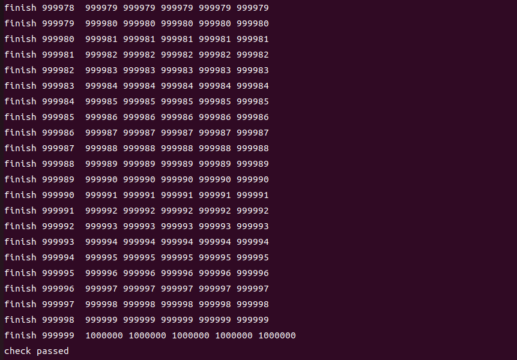
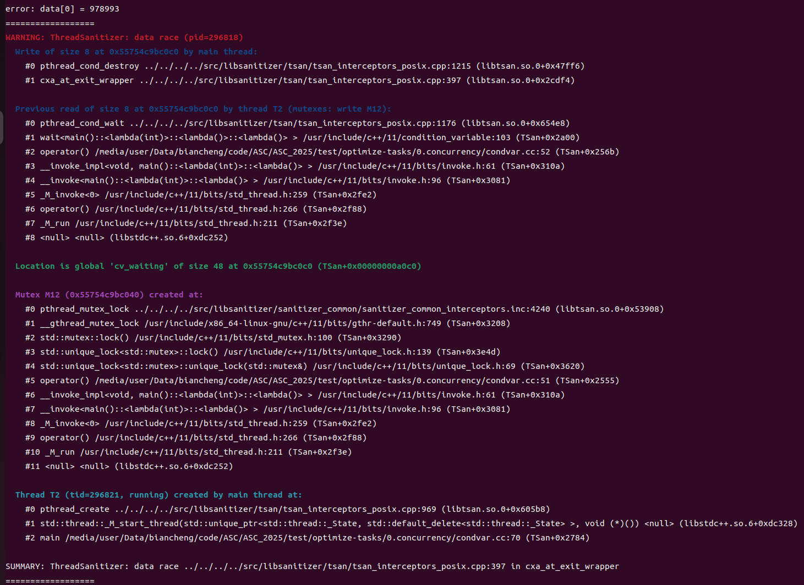

---
# 文章标题
title: ASC2025 TEST_0_CONCURRENCY
# 设置写作时间
date: 2024-12-15
# 一个页面可以有多个分类
category:
  - ASC
# 一个页面可以有多个标签
tag:
  - TEST
  - ASC
  - 2025competition
# 此页面会在文章列表置顶
sticky: true
# 此页面会出现在文章收藏中
star: true
# 侧边栏的顺序
# 数字越小越靠前，支持非整数和负数，比如 -10 < -9.5 < 3.2, order 为 -10 的文章会最靠上。
# 个人偏好将非干货或随想短文的 order 设置在 -0.01 到 -0.99，将干货类长文的 order 设置在 -1 到负无穷。每次新增文章都会在上一篇的基础上递减 order 值。
order: -1.52
---

## How to find the bugs in the program

> reference: https://nj.gitbooks.io/c/content/content/chapter10/chapter10-chinese.html


### parallel problem bugs

#### unnecessary block

- dead lock
- live lock(condition not met)
- I/O block

#### conditional competition

- data race
- destroy constant
- life circle issues

### how to find bugs

- read codes
- set breakpoint
- use tools

## how did I find bugs in the pro

below steps are tying to test a progect when i didn't know if there were bugs.  

### step1: try to run the code and monitor the output

We can compile the code to a executable file by the instruction in the terminal, just a try.  

```bash
gcc condvar.cc -o try -pthread -lstdc++
```

then run "try", the output is "error: data[0] = 718613".  

so we can confirm there are some bugs in the codes, then try to find them.  

we need to use some tools, such as `ThreadSanitizer`, to confirm the specific issue type.  

```bash
g++ condvar.cc -fsanitize=thread -fPIE -pie -g -o TSan
```

then run the "TSan"

the output is "WARNING: ThreadSanitizer: data race (pid=30965)". so we can confirm there exist "data race" issue. then read codes to try to find if not "join()" or "condition variable" are here.



### step2: read the codes and understand the brief frame

* "create_func" is a lambda expression and define the tasks of each thread.
    1. wait "m_waiting" to start work
    2. fetch a task, decrease the waiting task count
    3. thread of array position += 1
    4. one thread finish the task then notify the main thread by "notify_one()"
* the first "for circle" is set to creat the threads
* the second "for circle" is set to finish the main thread's task
    1. update the waiting task count and notify all threads to start working
    2. wait for all threads to finish and clear the finished task count, enter the next round
* the last "for circle" is set to check.

### step3: set some log information

if we are back to the step1, you will find seem "warning" is after the data check, meaning we can't find the data error, so we must set some log information.

I choice to set the below codes.  

```cpp
// run 1000000 rounds
    for (int i = 0; i < 1000000; i++) {
        // update the waiting task count
        lock lk_waiting(m_waiting);
        waiting = 5;
        std::fill(worktime.begin(), worktime.end(), true);
        // notify all threads to start working
        cv_waiting.notify_all();
        lk_waiting.unlock();

        // wait for all threads to finish
        lock lk_finished(m_finished);
        cv_finished.wait(lk_finished, []() { return finished == 5; });
        // clear the finished task count, enter the next round
        finished = 0;
        lk_finished.unlock();
        
        // log information
        printf("finish %d  %d %d %d %d %d\n", i, data[0], data[1], data[2], data[3], data[4]);
    }

```

after recompile and run it again, I found suprisely the five data sum up to `5000000`, but one of them was not `1000000`.  

the answer is found out, threads of the task didn't work balancedly, some time some threads may work more than one time in one circle, so we just need to make sure just once.

## how did I fix the bugs

### step1: fix unbalanced work

I choice to introduce a new condition variable `worktime` for 5 threads, to make sure just work one time in one circle.

```cpp
vec_t<bool> worktime (5, 0);
```

then I add them into every threads as a judgement for starting to get work.  

```cpp
auto create_func = [](int tid) {
        return [tid]() {
            while (true) {
                // wait for the signal to start working or exit
                lock lk_waiting(m_waiting);

                // add worktime
                cv_waiting.wait(lk_waiting, [tid]() { return waiting > 0 && worktime[tid] || exit_flag.load(); });

                if (exit_flag.load() && !worktime[tid]) {
                    break;
                }

                if (worktime[tid]) {
                    // fetch a task, decrease the waiting task count
                    waiting--;
                    worktime[tid] = false;
                    lk_waiting.unlock();
                    
                    // do the work
                    data[tid] += 1;

                    // increase the finished task count
                    lock lk_finished(m_finished);
                    finished++;
                    cv_finished.notify_one();
                    lk_finished.unlock();
                }
            }
        };
    };
```

and update the worktime at the beginning of every circle.

```cpp
for (int i = 0; i < 1000000; i++) {
        // update the waiting task count
        lock lk_waiting(m_waiting);
        waiting = 5;

        //update the worktime
        std::fill(worktime.begin(), worktime.end(), true);

        // notify all threads to start working
        cv_waiting.notify_all();
        lk_waiting.unlock();

        // wait for all threads to finish
        lock lk_finished(m_finished);
        cv_finished.wait(lk_finished, []() { return finished == 5; });
        // clear the finished task count, enter the next round
        finished = 0;
        lk_finished.unlock();

        printf("finish %d  %d %d %d %d %d\n", i, data[0], data[1], data[2], data[3], data[4]);
    }
```

then we can get `check passed!`  



### step2: exit sucessfully

this issue is easy to find out the reason, we can see it in the "WARNING: ThreadSanitizer: data race (pid=30965)".  

By analysing the warning, we can easily find the issue occur when the main thread finished and try to destroy the global variables, but other threads are using them.

so we just need to use a variable to notify the thread to stop and use join() function to let main thread wait other threads.  

```cpp
// notify the thread to stop
    exit_flag.store(true);
    cv_waiting.notify_all();

// use join() to wait
for (auto &t : threads) {
        if (t -> joinable()) {
            t -> join();
        }
        delete t;
    }
```

then we can exit sucessfully!  

check passed!  

## my answer

```cpp
/*
 * This task has 5 threads, each thread will increase the corresponding element
 * in the data vector by 1. The main thread will run 1000000 rounds, in each
 * round, it will notify all threads to start working, and wait for all threads
 * to finish.
 *
 * After 1000000 rounds, the main thread will check if all elements in the
 * data vector are 1000000.
 *
 * 1. Find the bug in the code, and fix it.
 * 2. The code can bot exit normally, fix it, ensure all working threads are
 * finished before the main thread exit.
 *
 */

#include <condition_variable>
#include <cstdio>
#include <cstdlib>
#include <mutex>
#include <thread>
#include <vector>
#include <atomic>

using std::mutex;
using std::thread;
using lock = std::unique_lock<std::mutex>;
using condvar_t = std::condition_variable;

template <typename T>
using vec_t = std::vector<T>;

mutex m_waiting;
mutex m_finished;
mutex m_workonce;

condvar_t cv_waiting;
condvar_t cv_finished;
condvar_t cv_workonce;

std::atomic<bool> exit_flag(false);

int waiting = 0;
int finished = 0;

// the data to be processed
vec_t<int> data(5, 0);

vec_t<bool> worktime (5, 0);


auto main() -> int {
    vec_t<thread*> threads(5);

    auto create_func = [](int tid) {
        return [tid]() {
            while (true) {
                // wait for the signal to start working or exit
                lock lk_waiting(m_waiting);
                cv_waiting.wait(lk_waiting, [tid]() { return waiting > 0 && worktime[tid] || exit_flag.load(); });

                if (exit_flag.load() && !worktime[tid]) {
                    break;
                }

                if (worktime[tid]) {
                    // fetch a task, decrease the waiting task count
                    waiting--;
                    worktime[tid] = false;
                    lk_waiting.unlock();
                    
                    // do the work
                    data[tid] += 1;

                    // increase the finished task count
                    lock lk_finished(m_finished);
                    finished++;
                    cv_finished.notify_one();
                    lk_finished.unlock();
                }
            }
        };
    };

    for (int i = 0; i < 5; i++) {
        threads[i] = new thread(create_func(i));
    }

    // run 1000000 rounds
    for (int i = 0; i < 1000000; i++) {
        // update the waiting task count
        lock lk_waiting(m_waiting);
        waiting = 5;
        std::fill(worktime.begin(), worktime.end(), true);
        // notify all threads to start working
        cv_waiting.notify_all();
        lk_waiting.unlock();

        // wait for all threads to finish
        lock lk_finished(m_finished);
        cv_finished.wait(lk_finished, []() { return finished == 5; });
        // clear the finished task count, enter the next round
        finished = 0;
        lk_finished.unlock();

        printf("finish %d  %d %d %d %d %d\n", i, data[0], data[1], data[2], data[3], data[4]);
    }

    exit_flag.store(true);
    cv_waiting.notify_all();

    for (auto &t : threads) {
        if (t -> joinable()) {
            t -> join();
        }
        delete t;
    }


    // check, all element in data should be 1000000
    for (int i = 0; i < 5; i++) {
        if (data[i] != 1000000) {
            printf("error: data[%d] = %d\n", i, data[i]);
            return 1;
        }
    }

    printf("check passed\n");

    return 0;
}

```