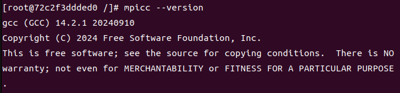
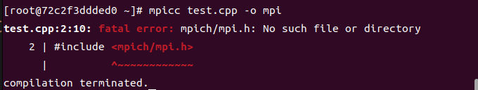
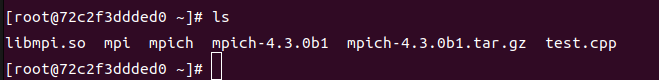
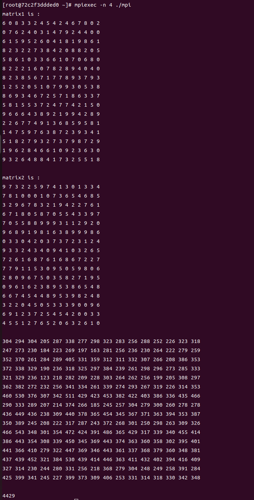
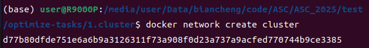
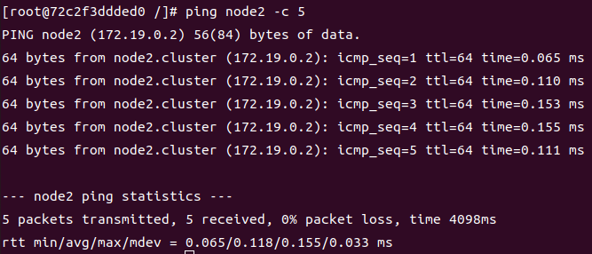
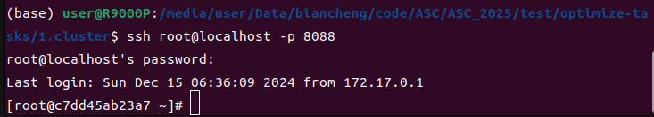
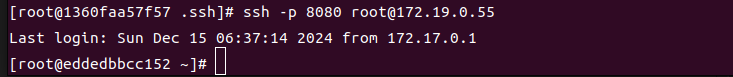
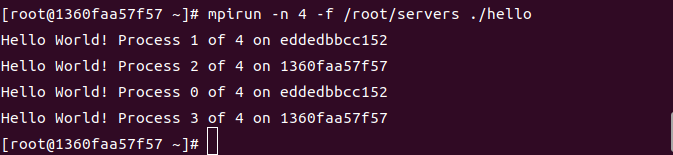

---
# 文章标题
title: ASC2025 TEST_1_cluster
# 设置写作时间
date: 2024-12-15
# 一个页面可以有多个分类
category:
  - ASC
# 一个页面可以有多个标签
tag:
  - TEST
  - ASC
  - 2025competition
# 此页面会在文章列表置顶
sticky: true
# 此页面会出现在文章收藏中
star: true
# 侧边栏的顺序
# 数字越小越靠前，支持非整数和负数，比如 -10 < -9.5 < 3.2, order 为 -10 的文章会最靠上。
# 个人偏好将非干货或随想短文的 order 设置在 -0.01 到 -0.99，将干货类长文的 order 设置在 -1 到负无穷。每次新增文章都会在上一篇的基础上递减 order 值。
order: -1.51
---

## Installation

it's easy to finish the envirment settings, so I just talk about some issues occuered.

### step1: unzip the `baseenv.tar.gz`

```bash
tar -xvf baseenv.tar.gz
```

> may the .tar.gz file be unziped to many files. my solution is packing them in a new .tar file by `tar cvf bassenv.tar bassenv`.

then we can get the package `baseenv.tar`.  

### step2: Load the Docker image from the .tar file

```bash
docker load -i baseenv.tar
```

### step3: start the container with the following command

```bash
#node1
docker run -it --cap-add NET_ADMIN --name node1 baseenv:latest /bin/bash

#node2
docker run -it --cap-add NET_ADMIN --name node2 baseenv:latest /bin/bash
```

However, if we want to make sure `not connect to the internet from the container`, we can use the below instruction:

```bash
#node1
docker run -it --cap-add NET_ADMIN --sysctl net.bridge.bridge-nf-call-iptables=0 --name node1 baseenv:latest /bin/bash
```

> reference: https://cloud.tencent.com/developer/article/2335144

this allows us to access intranet but not to access the Internet in the container.

## task

### task1: compile the `mpich`

> reference: https://blog.csdn.net/u014185088/article/details/121482116

after create the continer, we can `cd root` and ues `ls` to find the `mpich-4.3.0b1`, then unzip it.

#### step1: set mpich configure and make it

```bash
cd mpich-4.3.0b1
# use --disable-fortran to ban the fortran setting
./configure --prefix=/root/mpich --disable-fortran

# make it
make && make install
```

then set PATH:  

```bash
vim ~/.bashrc
# write
export MPIPATH=/root/mpich
export MPIPATHBIN=$MPIPATH/bin
export MPIPATHINCLUDE=$MPIPATH/include
export MPIPATHLIB=$MPIPATH/lib
export MPIPATHSHARE=$MPIPATH/share
export PATH=$PATH:$MPIPATHBIN:$MPIPATHINCLUDE:$MPIPATHLIB:$MPIPATHSHARE
```

then we can see the `mpicc` version:



let's try a mpi programm in a continer.

I copy a `test.cpp` from the Internet.

```cpp
#include <stdio.h>
#include <mpich/mpi.h>
#include <string.h>
#include <stdlib.h>
#include <math.h>
#include <time.h>
#include<omp.h>
#include<iostream>
using namespace std;
//生成随机矩阵
int *generate_matrix(int size)
{
	srand((unsigned)time(NULL) + (unsigned)rand());
	int *matrix;
	matrix = (int *)malloc(sizeof(int) * size*size);
	for (int i = 0; i < size*size; i++)
	{
		matrix[i] = rand() % 10;
	}
	return matrix;
}
//输出矩阵
void print_matrx(int *a, int size)
{
	for (int i = 0; i < size; i++)
	{
		for (int j = 0; j < size; j++)
		{
			printf("%d ", a[i*size + j]);
		}
		printf("\n");
	}
	printf("\n");
}
//矩阵相乘
int * Multiplication(int a[], int b[], int size, int line)
{
	int *result;
	int temp = 0;
	result = (int *)malloc(sizeof(int) * size*size);
//#pragma omp parallel for num_threads(2)
	for (int i = 0; i < line; i++)
	{
		for (int j = 0; j < size; j++)
		{
			temp = 0;
			for (int k = 0; k < size; k++)
				temp += a[i*size + k] * b[k*size + j];
			result[i*size + j] = temp;
		}
	}
	return result;
}
int main(int argc, char *argv[])
{
	clock_t time1, time2;
	int size = 16, rank, line, num;
	time1 = clock();
	MPI_Init(&argc, &argv);
	MPI_Comm_rank(MPI_COMM_WORLD, &rank);
	MPI_Comm_size(MPI_COMM_WORLD, &num);
	int *matrix1;
	int *matrix2;
	int *matrix3;
	int *resultMg;
	int *revMg;
	int *resultMg0;
	line = size / num ;  //num为进程数，line为每个进程的行数
	matrix1 = (int*)malloc(sizeof(int)*size*size);
	matrix2 = (int*)malloc(sizeof(int)*size*size);
	matrix3 = (int*)malloc(sizeof(int)*size*size);
	resultMg = (int*)malloc(sizeof(int)*size*line);
	resultMg0 = (int*)malloc(sizeof(int)*size*line);
	revMg = (int*)malloc(sizeof(int)*size*line);
	if (rank == 0)
	{
		matrix1 = generate_matrix(size);
		matrix2 = generate_matrix(size);

		printf("matrix1 is :\n");
		print_matrx((int *)matrix1, size);

		printf("matrix2 is :\n");
		print_matrx((int *)matrix2, size);

		resultMg0=Multiplication(matrix1,matrix2, size, line);
		for (int m = 0; m < line; m++)
			for (int n = 0; n < size; n++)
				matrix3[m*size + n] = resultMg0[m*size + n];

		for (int i = 1; i < num; i++)
			MPI_Send(matrix2, size*size, MPI_INT, i, 0, MPI_COMM_WORLD);

		for (int i = 1; i < num; i++)
			MPI_Send(matrix1 + i*line*size, size*line, MPI_INT, i, 1, MPI_COMM_WORLD);

		for (int i = 1; i < num; i++)
		{
			MPI_Recv(resultMg, line*size, MPI_INT, i, 3, MPI_COMM_WORLD, MPI_STATUS_IGNORE);
			for (int m = 0; m < line; m++)
				for (int n = 0; n < size; n++)
					matrix3[(i*line + m)*size + n] = resultMg[m*size + n];
		}
		time2 = clock();
		print_matrx((int *)matrix3, size);
		cout << time2 - time1 << endl;
		free(matrix1);
		free(matrix2);
		free(matrix3);
		free(revMg);
		free(resultMg);
	}
	else {
		MPI_Recv(matrix2, size*size, MPI_INT, 0, 0, MPI_COMM_WORLD, MPI_STATUS_IGNORE);
		MPI_Recv(revMg, size*line, MPI_INT, 0, 1, MPI_COMM_WORLD, MPI_STATUS_IGNORE);
		resultMg = Multiplication(revMg, matrix2, size, line);
		MPI_Send(resultMg, line*size, MPI_INT, 0, 3, MPI_COMM_WORLD);
	}

	MPI_Finalize();
	return 0;
}

```

then use the below instruction copy the code to the continer.  

```bash
docker cp /media/user/Data/biancheng/code/ASC/ASC_2025/test/optimize-tasks/1.cluster/test.cpp node1:/root
```

try to compile the `test.cpp`.  



oops, we seem to need to use the `absolute address`.  

```cpp
// fix the code
#include <mpich/mpi.h>
// right code
#include "/root/mpich/include/mpi.h"
```

then we can find `mpi`  



run the programm

```bash
mpiexec -n 4 ./mpi
```



check passed!

### task2: configure the network for containers

creat a new net for continers

```bash
docker network create cluster
```



and add the node1 & node2 into the net.

```bash
docker network connect cluster node1
docker network connect cluster node2
```

then try to ping node2 from node1.



check passed!

#### task3: configure ssh for the containers

Firstly, we need to set a password for ssh.  

```bash
passwd
```

my password is set to `asc2025`.

we need to change the `PermitRootLogin prohibit-password` to `PermitRootLogin yes`, and change port from `22` to `8080`.  

```bash
vim /etc/ssh/sshd_config
```

use `docker commit` to build a new image.

```bash
docker commit -m 'ssh' -a 'node1:ssh' node1  node1:ssh
```

then use the new image to build two new nodes to set port.  

```bash
docker run -it -d -p8088:8080 --cap-add NET_ADMIN --sysctl net.bridge.bridge-nf-call-iptables=0 --name node1_ssh node1:ssh /bin/bash
```  

start the new continer, and start the ssh.

```bash
/usr/sbin/sshd
```

then we can use password to connect with the continer from the host.



then we can try to login in the node1 from node2.



check passed!

#### task4: run the MPI program in the cluster

then we can use a test programm to test the connection.  

```c
#include "/root/mpich/include/mpi.h" 
#include <stdio.h> 
#include <math.h> 
int main(int argc, char *argv[])
{
  int myid, numprocs; 
  int namelen;
  char processor_name[MPI_MAX_PROCESSOR_NAME]; 
  MPI_Init(&argc,&argv);
  MPI_Comm_rank(MPI_COMM_WORLD,&myid); 
  MPI_Comm_size(MPI_COMM_WORLD,&numprocs); 
  MPI_Get_processor_name(processor_name,&namelen);
  fprintf(stderr,"Hello World! Process %d of %d on %s\n", myid, numprocs, processor_name);
  MPI_Finalize();
}
```



we can change the name of the container from the host configure, just I didn't do it.

check passed!

> tips: the container should exist the `hello` and the environment of the MPI.

