---
# 文章标题
title: AISys_分布式开发（选读）
# 设置写作时间
date: 2024-10-28
# 一个页面可以有多个分类
category:
  - SOSD
# 一个页面可以有多个标签
tag:
  - 分布式系统
  - AISys
  - 并行运算
# 此页面会在文章列表置顶
sticky: true
# 此页面会出现在文章收藏中
star: true
# 侧边栏的顺序
# 数字越小越靠前，支持非整数和负数，比如 -10 < -9.5 < 3.2, order 为 -10 的文章会最靠上。
# 个人偏好将非干货或随想短文的 order 设置在 -0.01 到 -0.99，将干货类长文的 order 设置在 -1 到负无穷。每次新增文章都会在上一篇的基础上递减 order 值。
order: -1.3
---
## 序列并行

### Megatron

Reducing Activation Recomputation in Large Transformer Models

`https://arxiv.org/pdf/2205.05198`

#### Abstract

在大模型训练过程中显存占用过大往往成为瓶颈，一般会通过`重计算`的方式降低显存占用，但会带来额外的计算代价。本文提出`sequece parallel(序列并行,简称SP)`和`selective activation recomputation`两种方法，可以结合TP有效减少不必要的计算量。  

下图中绿色部分表示不同参数级别模型中需要用于保存activation需要的显存大小，蓝色部分表示不同参数级别模型中需要用于保存`parameter`和`optimizer state`需要的显存大小。红色线表示baseline(A100的显存)80G。  

通过对比可以发现,原本单A100跑不了的模型,经过SP优化后可以在单A100上运行了,这就给我们加大数据量和多机并行提供了极大的便利  

  

#### Activation Memory

本文以Transformer结构为例估算`Activation Memory`，Activation指FWD和BWD梯度计算中创建的所有`tensor`。不包含模型参数大小和优化器中状态大小，但是包含dropout用到的`mask tensor`。  

  

本文推导与假设中用到了以下几个参量:  
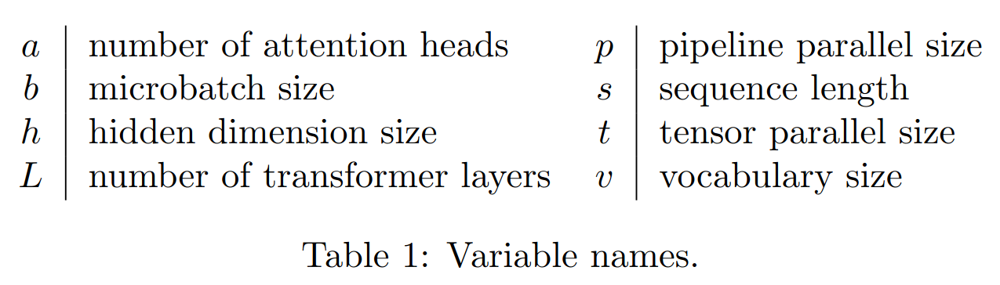  

本文假设h极大(实际上一般也确实极大), 认为2sb远小于sbh, 即只考虑中间过程的Memory(shb), 忽略输入输出的Memory  

对于Attention模块,这一部分依赖于softmax实现:  

$$ Attention(Q,K,V)=softmax(\frac{QK^T}{\sqrt{d_k}})V $$  

具体实现图例见下:  

  

对于`Attention`块来说，输入的元素个数为`sbh`个，每个元素以`半精度`(2 bytes)来进行存储的话，对应输入的元素大小为`2sbh bytes`  

`Attention`块中包含一个`self-attention`、一个`linear(线性映射层)`和`attention dropout`层。对于`linear`需要保存输入的`Activation`大小为`2sbh`, 对于`attention dropout`层需要`mask`的大小为`sbh`(对于一个元素的mask只用1个bytes)，对于`self-attention`块的`Activation Memory`的计算有以下几块：  

- Query(Q),Key(K),Value(V) `matrix mul`：input共享，元素个数为sbh个，总大小是 `2sbh bytes`。
- $QK^{T}$矩阵相乘：需要分别创建保存$Q$和$K$的矩阵，每个矩阵元素总大小为`2sbh bytes`, 总共大小为`4sbh bytes`

原始Self-Attention例子(此处X切分仅作示意,实际上是按行切分的):  

  

  

- dropout的mask层矩阵的大小与softmax的输出一样，元素个数都是$as^{2}b$个，但mask单个元素的大小只用`1 bytes`即可，总的大小为 $as^{2}b$ bytes

- softmax的输出也会用于反向的计算，需要缓存下来，对应大小 $as^{2}b$ bytes

- $V$矩阵的大小之前没有统计，和$Q$、$K$矩阵一样，大小也是`2sbh bytes`

> Attention 模块总的大小为 11sbh + 5$as^{2}b$ bytes。  

`MLP的Activation大小计算`：MLP中有两层线性layer，分别存储输入矩阵大小为`2sbh bytes`和`8sbh bytes`；GeLU的反向也需要对输入进行缓存，大小为`8sbh bytes`; dropout层需要`sbh bytes`; 总大小为`19sbh`。

`LayerNorm的Activation大小计算`：每个LayerNorm层的输入需要`2sbh`大小，有两个LayerNorm层，总大小为`4sbh bytes`.  

一层transformer的memory总的大小为:  

$$ ActivationMemoryPerLayer=sbh\left(34+5\frac{as}h\right) $$  

#### Tensor Parallel

在TP并行中只在Attention和MLP两个地方进行了并行计算，对于两块的输入并没有并行操作。    

图中$f$和$\overline{f}$互为共轭(conjugate)，$f$在前向时不做操作，反向时执行all-reduce;$\overline{f}$在前向时执行all-reduce, 反向时不做操作。

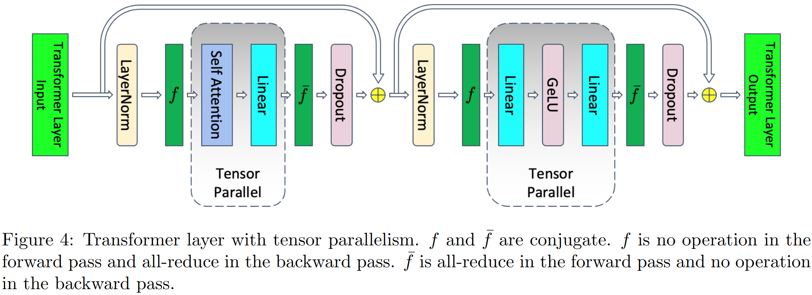  

考虑TP并行(并行度为$t$)，并行部分有MLP的Linear部分(18sbh bytes)和Attention的QKV部分(6sbh bytes)， `ActivationMemoryPerLayer`的值降为：  

$$ActivationMemoryPerLayer=sbh\left(10+\frac{24}t+5\frac{as}{ht}\right)$$

#### Sequence Parallel

在Tensor模型并行基础上提出了`Sequence Parallel`，对于非TP并行的部分在sequence维度都是相互独立的，所以可以在sequence维度上进行拆分(即sequence parallel)。  

拆分后如下图，$f$和$\overline{f}$替换为$g$和$\overline{g}$​在前向是reduce-scatter, 反向是all-gather通信。  

  

以MLP为例，详细说明拆分步骤:  

MLP层由两个Linear层组成，对应的计算公式如下, 其中$X$的大小为$s × b × h$;$A$和$B$是Linear的权重weight矩阵，大小为$h × 4h$和$4h×h$  

论文做如下符号说明:  

$$\begin{aligned}Y&=\text{LayerNorm}(X),\\Z&=\text{GeLU}(YA),\\W&=ZB,\\V&=\text{Dropout}(W),\end{aligned}$$

  

- 对$X$按sequence维度切分， $X = \left[ X^s_1, X^s_2 \right]$，LayerNorm的结果$Y = \left[ Y^s_1, Y^s_2 \right]$；
- 考虑GeLU非线性，进行all-gather，计算$Z = GeLU(YA)$；
- 对$A$进行列切分的tensor并行，得到结果$YA^c_1$​和$YA^c_2$
- 对$B$进行行切分的tensor并行，得到结果$Z^h_1 B^r_1$和$Z^h_2 B^r_2$
- 得到$W_1$和$W_2$后进行reduce-scatter  

具体过程见下:  

$$\begin{aligned}
[Y_1^s,Y_2^s]& \begin{aligned}&=\text{LayerNorm}([X_1^s,X_2^s]),\end{aligned} \\
\text{Y}& =g(Y_1^s,Y_2^s), \\
\begin{aligned}[Z_1^h,Z_2^h]\end{aligned}& =[\text{GeLU}(YA_1^c),\text{ GeLU}(YA_2^c)], \\
W_{1}& =Z_1^hB_1^r\text{ and }W_2=Z_2^hB_2^r, \\
\begin{aligned}[W_1^s,W_2^s]\end{aligned}& =\bar{g}(W_1,W_2), \\
\begin{aligned}[V_1^s,V_2^s]\end{aligned}& =[\mathrm{Dropout}(W_1^s),\text{ Dropout}(W_2^s)]. 
\end{aligned}$$

TP在一次前向和后向总共有4次的`all-reduce`操作，在SP一次前向和后向总共有4次`all-gather`和4次`reduce-scatter`操作。  
`ring all-reduce` 执行过程中有两步，先是一个`reduce-scatter`然后一个`all-gather`，SP没有引入更多的通信代价。  

$$\begin{aligned}
ActivationMemoryPerLayer& =sbh\left(\frac{10}t+\frac{24}t+5\frac{as}{ht}\right) \\
&=\frac{sbh}t\left(34+5\frac{as}h\right)
\end{aligned}$$  

### DeepSpeed-Ulysses

`DeepSpeed Ulysses: System Optimizations for Enabling Training of Extreme Long Sequence Transformer Models`  
`https://arxiv.org/pdf/2309.14509`  

> DeepSpeed在知乎也有官号, 这里仅作简述, 官号本身讲的也非常不错, 链接在这儿:https://zhuanlan.zhihu.com/p/652206513

#### 简介  

- 长序列在LLM应用中非常重要, 长上下文的保存有助于LLM推理, 需求大token和长Sequence的输入  
- 现有的DP TP PP不能解决序列维度的扩展问题
- 现有的序列并行方法依托内存通讯, 不够高效  

DeepSpeed-Ulysses将各个样本在`序列维度`上分割给参与的GPU。在attention计算之前，它对已分割的查询(Q)、键(K)和值(V)执行`all-to-all`通信操作，以使每个GPU接收完整的序列，但仅用于注意力头的`非重叠子集`。  
这使得参与的GPU可以并行计算不同的注意力头。最后，DeepSpeed-Ulysses还使用另一个`all-to-all`来在注意力头上收集结果，同时重新在序列维度上进行分区。  

#### DeepSpeed-Ulysses的核心设计  

  

与已知的Transformer架构一样，设计由`N个输入序列`在`P个可用设备`上分区组成。每个本地N/P分区都被投影到查询（Q）、键（K）和值（V）嵌入中。接下来，(QKV) 嵌入通过参与计算设备之间的高度优化的全对全集合（all-to-all collectives）进行全局的 QKV 收集。在全对全集合后，每个头的注意力计算形式为：

$$Output~context=Softmax~(\frac{QK^T}{\sqrt{d}})V$$  

注意力计算后，另一个全对全集合将注意力计算的输出上下文张量转换为序列(N/P)并行，用于Transformer模型层的剩余模块中的后续操作。

### Sequence Parallelism

`Sequence Parallelism: Long Sequence Training from System Perspective`  
`https://arxiv.org/pdf/2105.13120`

#### 论文背景

和Ulysses一样, 这个SP也是目的也是解决输入序列规模问题, 而不是像Megtron-LM一样解决计算过程中的内存占用问题.  

文章将自己的SP流程和PP TP模型做了比较:  
  

#### 主要工作  

本文认为SP最主要的问题是跨设备如何计算`sub-sequences`的`attention scores`问题，为了解决该问题，本文设计出`Ring Self-Attention`来解决此问题.  
> 感觉想法来源于Ring-AllReduce, 而且只优化了自注意力部分

  

> RSA感觉就是将输入序列进行切分, 通过将序列整体切分成小的chunk, 使得每一个chunk都尽可能大, 用commnication换取序列长度

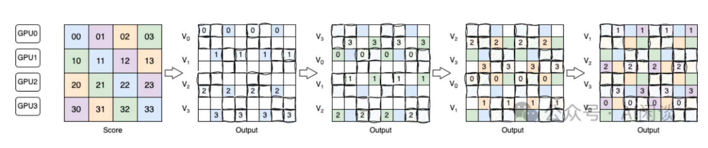  

### Ring-Attention

`Ring Attention with Blockwise Transformers for Near-Infinite Context`  
`https://arxiv.org/pdf/2310.01889`

#### 背景

老生常谈的transformer长序列要求，不做赘述。

#### Ring Attention

本文提出以`分块方式`执行Self-Attention和FWD计算，多机分布序列维度，从而实现并发计算和通信.  
由于该方法将环中主机设备之间的`Key Value Block`通信与compute重叠，因此将其命名：`环注意(Ring Attention)`  

具体实现：  

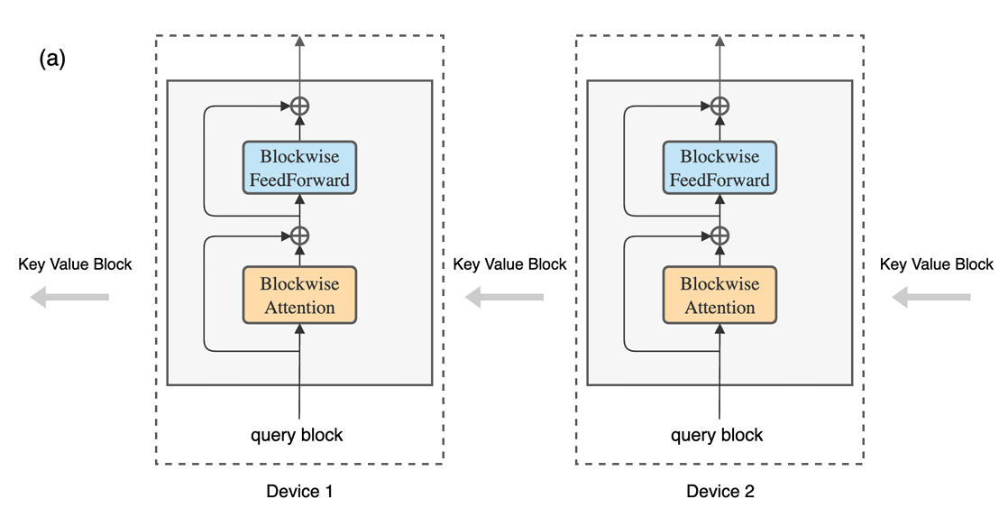  

该方法在主机设备之间构建Self-Attention的外循环，每个主机设备具有一个`query block`，并通过`Key Value Block`遍历主机`Ring`，以`逐块`的方式进行注意力和前馈网络计算。  
当计算Self-Attention时，每个主机将`Key Value Block`发送到下一个主机，同时从前一个主机接收`Key Value Block`。  

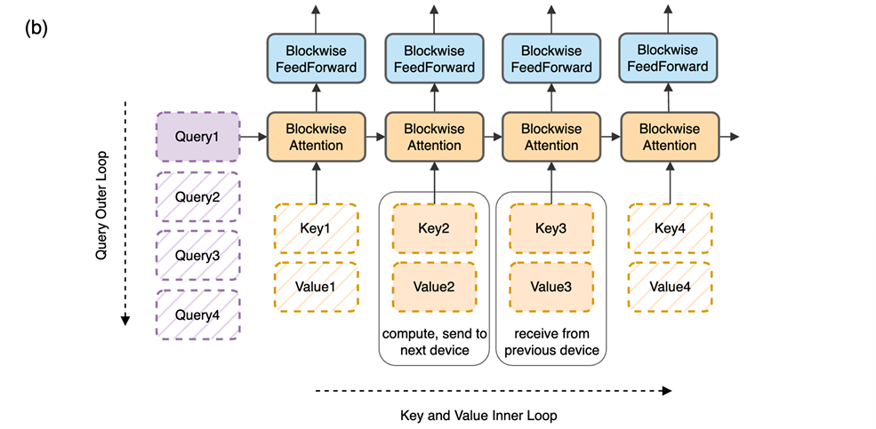  

对于内循环，每个设备计算其各自的Self-Attention和FWD。在内循环期间，每个设备将用于compute的`Key Value Block`的副本发送到Ring中的下一个设备，同时从前一个设备接收`Key Value Block`。  
由于`块计算比块传输需要更长的时间`，与标准Transformer相比，此过程不会增加开销。  

> 这种Ring Attention方式可以突破序列长度限制（对于单卡内存需求来说，而非模型整体来说），因为我们在Attention之前矩阵乘就已经切分了Squence，让每一个卡分批成环去跑一小批token
> 
> 这种方式理论上并不影响训练结果，因为最小训练单位还是一个token（对Squence做切分时的原则）
> 
> 天才般的想法！（我觉得）好吧也需要堆卡出奇迹

> 那么代价呢？
> 文章的训练测试规模比较小，能否在大规模训练时取得想象中的线性效果，还是未知数
> 文章只对Attention和FWD操作做了优化，基础操作还有进一步优化的空间，可以考虑采用4D并行。

### DISTFLASHATTN

`https://arxiv.org/pdf/2310.03294`

#### 背景

部分SP方法，如Ring Attention缺少高效的Attention实现。（前文提及的`基础操作还有进一步优化的空间`）

#### 论文方法

文章针对三个challenge提出了三个解决方法，解决了高校Attention实现、分布式应用等问题。  

##### token-level workload imbalance
这主要是由于causal mask引起的attention计算问题，如果简单分块计算约会有1/2的计算资源浪费。  
因为一般causal mask就是会用矩阵以对角线为界mask数据, 按照ring拓扑结构进行计算也会有约一半的CPU处于等待状态。  

针对这个问题，论文中提出`Token-level workload balancing`的调度算法，通过给空闲的worker来fetch部分key-value数据，计算后再传递回去。  

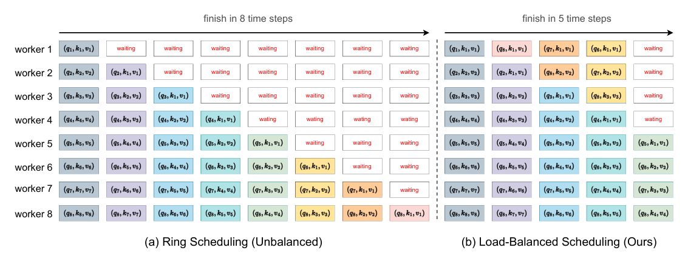  

##### Prohibitive communication overhead

需要通信汇总不同worker上的attention结果，本文提出通过计算$attn(q_p,k_r,v_r,s_p)$ prefetch张量来完成通信$worker\quad p\overset{k_{r+1},v_{r+1}}{\operatorname*{\longleftarrow}}worker\quad r+1$的覆盖，实现依赖于P2P的通信模式。  

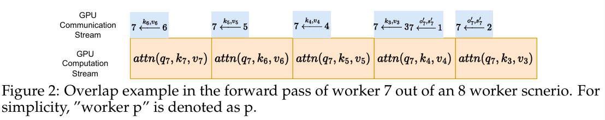  

#### Loadbalanced scheduling with communication and computation overlap

huggingface中采用的Recomputation的检查点放置不合理，导致相对高的还原计算代价。  
下面是两种重计算策略的对比：  
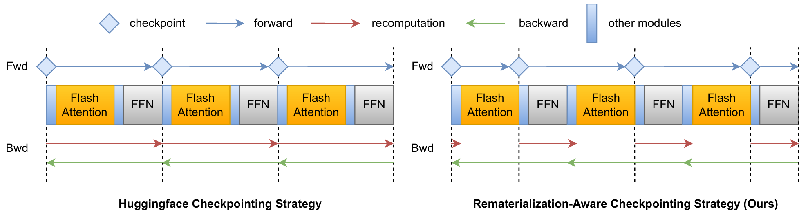  

DFA相较HF每一个`FlashAttention`+`FFN`约能够减少一个FA的计算量。  
`FlashAttention`部分的梯度更新为$K Q V$三个矩阵，可以通过FA的输出结果完成更新，因此保存FA的结果便可计算三者的矩阵。  

### 典型并行方式时序图

#### TP

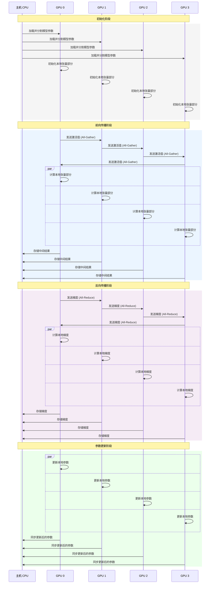

#### DP

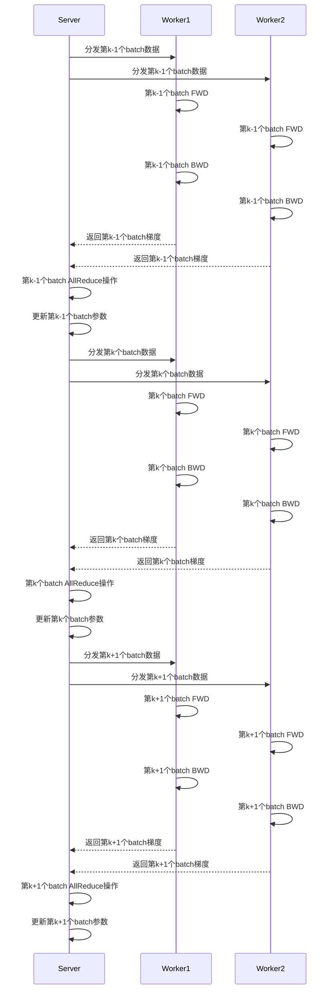

#### PP

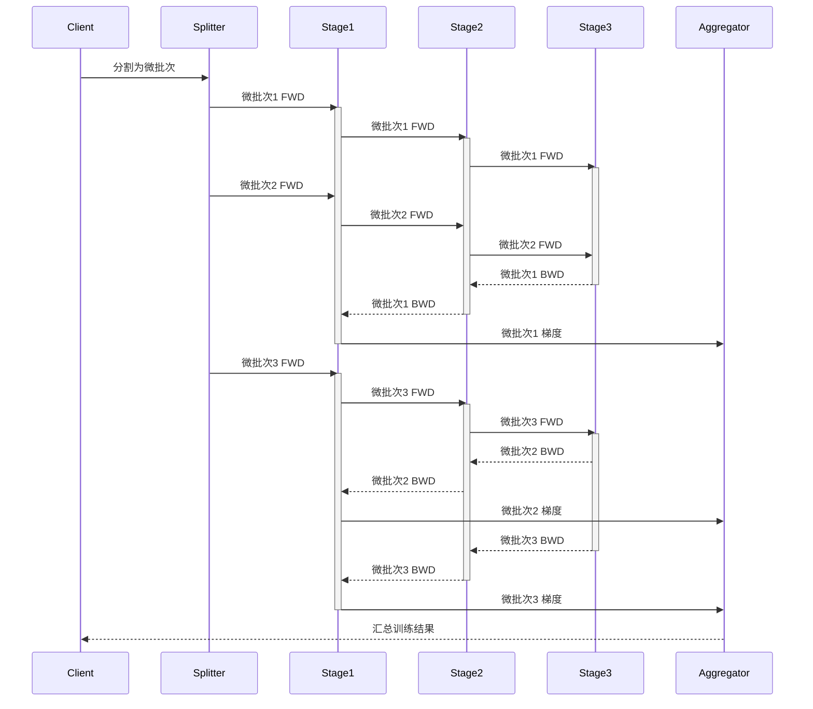