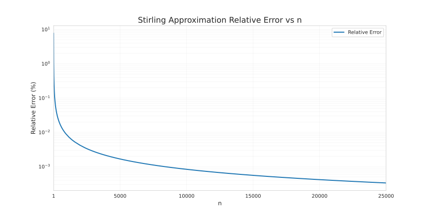

---
# 文章标题
title: 阶乘的位数估算--数学在计算机算法研究中的作用
# 设置写作时间
date: 2024-09-17
# 一个页面可以有多个分类
category:
  - 数据结构与算法
# 一个页面可以有多个标签
tag:
  - 算法
  - 数学
# 此页面会在文章列表置顶
sticky: true
# 此页面会出现在文章收藏中
star: true
# 侧边栏的顺序
# 数字越小越靠前，支持非整数和负数，比如 -10 < -9.5 < 3.2, order 为 -10 的文章会最靠上。
# 个人偏好将非干货或随想短文的 order 设置在 -0.01 到 -0.99，将干货类长文的 order 设置在 -1 到负无穷。每次新增文章都会在上一篇的基础上递减 order 值。
order: -0.01
--- 

## 题目引入

> 算法与数据结构实验题 1.10 单身狗进化
> 这一天晚上，弯通又做梦了，并且梦到了一个帅气的男孩纸！这个男孩给了弯通一个数字 n。男孩离开前告诉弯通，n!（n 的阶乘）的位数就是距离弯通脱单的天数。矜（ji）持（ke）的弯通想知道自己还有多久能脱单，快写个程序帮助他！  
> 输入:  
> 输入第一行为一个正整数 n（1<=n<=25000）。  
> 输出:  
> n阶乘的位数

## 题目分析

这道题看上去还挺有意思的~~很符合大学生的心理状态~~, 实际上就是要求阶乘的位数~~倒也没有拐弯抹角~~.  
但是我们都知道, 要是用`递归`或者`循环`写阶乘, 这将是一件极为恐怖的事情.  
在数据存储(空间复杂度)&计算用时(时间复杂度)上的开销, 将成为任何一台机器的噩梦, 更不可能过测试了.  
举个栗子:  

``` 用循环计算阶乘
    int n;
    long long ans = 1;
    std::cin >> n;
    for (int i = 1; i < MAX; i++)
        ans *= i;
    std::cout << ans;
```  

大家可以简单跑一下这个程序, 然后就会发现, 在`n = 27`的时候, 就已经溢出了, 完全无法满足题目要求.  
这就是第一种错误的可能, 忘记了估计数据规模, 随便算算就存爆了.  

还有一种可能, 就是采用高精度的算法, 将阶乘结果用表存储, 每个内存存有限位数据, 在乘法时做类似竖式乘法的高精度运算.  

这种方式能不能过这个题我没有试过~~因为我懒~~, 但是一般来说高精度阶乘的时间复杂度是$O(n^{2})$  

程序代码的复杂度和 `n = 25000` 所要存储的数据规模, 也会是比较大的开销.  

下文将介绍一种用数学方法巧妙估算阶乘结果规模的方式.

## 斯特林公式

$$ n!\approx {\sqrt {2\pi n}}\,\left({\frac {n}{e}}\right)^{n} $$  

这个公式以`詹姆斯·斯特林`的名字命名，虽然`亚伯拉罕·棣美弗`早于斯特林提出了一个类似的公式，但结果较不精确.  
当n很大的时候，n阶乘的计算量十分大，所以斯特林公式十分好用，而且，即使在n很小的时候，斯特林公式的取值已经十分准确.  

可以通过计算对比来估计一下斯特林公式算出结果, 和阶乘计算结果的误差程度.  

  

我们可以看到, 随着n的增大, 斯特林公式估算的误差已经降到了十万分之一以下, 这对估算阶乘的规模来说是完全可以接受的误差.  

通过斯特林公式我们可以简单估算阶乘的位数, 我们知道对于一个n进制数x, 都可以对其取$ [\log_{n}x] + 1 $来得到这个n进制数的位数, 我们将进一步推导`用斯特林公式估算阶乘位数N`的公式.  

$$ N = [log_{10}[{\sqrt {2\pi n}}\,\left({\frac {n}{e}}\right)^{n}]] + 1 $$  
其中内层中括号标记运算顺序, 外层中括号意为高斯取整(即向下取整).  

$$ N = [\frac{1}{2}log_{10}(2\pi n) + nlog_{10}(\frac{n}{e})] + 1 $$  

通过代入n, 即可轻松求得$n!$的位数, 时间复杂度是梦寐以求的O(1), 即常数时间复杂度.

## 代码实现

代码实现没什么好说的, 套公式罢了, 由于我之前已经测试过最大数据规模, 所以`ans`也是为了省事儿用的`int`~~偷懒是可耻的~~

```
  #include <stdio.h>
  #include <math.h>

  #define PI 3.141592654
  #define E 2.71828182846

  int pos(int n)
  {
      int s = 1;
      if(n > 3)
          s = log10(2*PI*n) / 2 + n * log10(n/E) + 1;
      return s;
  }

  int main()
  {
      int num, ans;
      scanf("%d", &num);
      ans = pos(num);
      printf("%d", ans);
  }
```

## 总结

> 数即一切  
