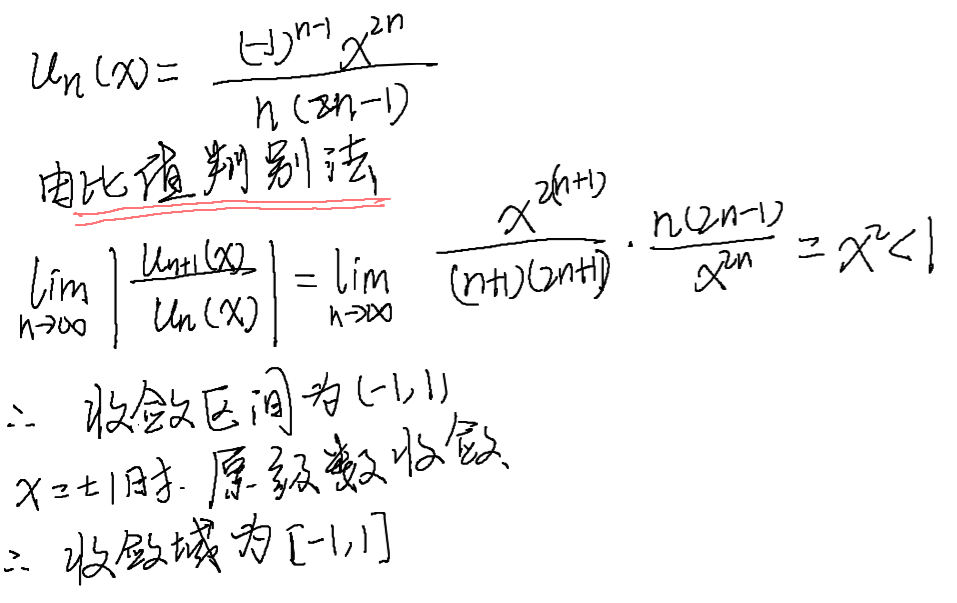

---
# 文章标题
title: CMC_15 初赛非数A记录
# 设置写作时间
date: 2024-10-03
# 一个页面可以有多个分类
category:
  - CMC
# 一个页面可以有多个标签
tag:
  - 数学
  - 日常练习
# 此页面会在文章列表置顶
sticky: true
# 此页面会出现在文章收藏中
star: true
# 侧边栏的顺序
# 数字越小越靠前，支持非整数和负数，比如 -10 < -9.5 < 3.2, order 为 -10 的文章会最靠上。
# 个人偏好将非干货或随想短文的 order 设置在 -0.01 到 -0.99，将干货类长文的 order 设置在 -1 到负无穷。每次新增文章都会在上一篇的基础上递减 order 值。
order: -0.011
---

## 填空题

### 4

幂级数$ \sum_{n = 1}^{\infty}\frac{(-1)^{n-1}x^{2n}}{n(2n-1)} $ 的收敛域为_____

### 5

设曲面$\Sigma$是平面$z+y=5$被柱面$x^{2}+y^{2}=25$截得的部分，