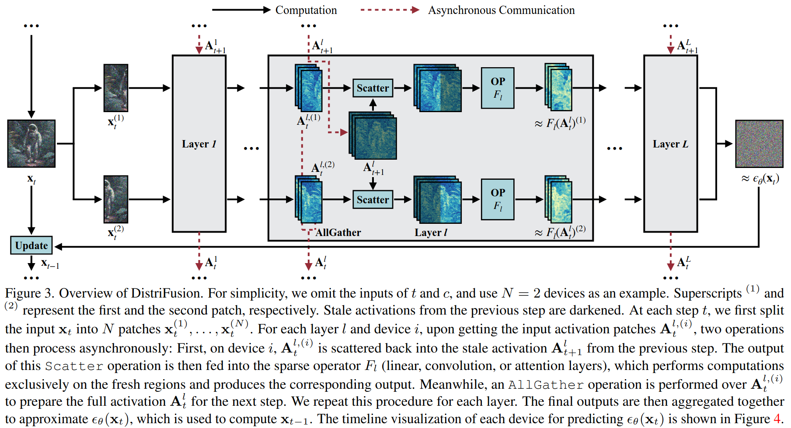
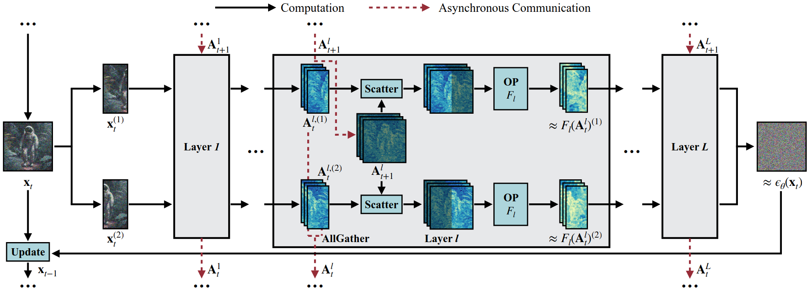
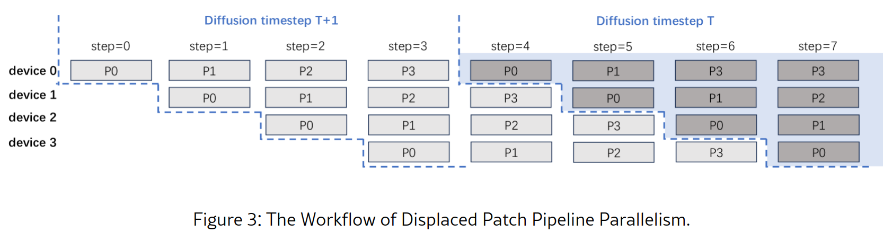
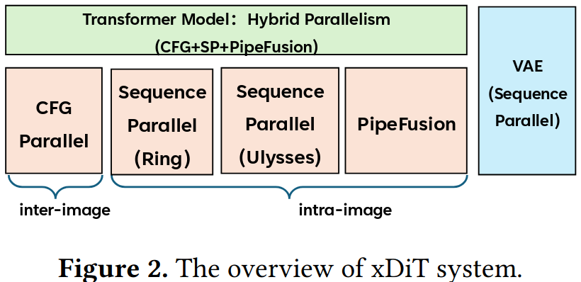
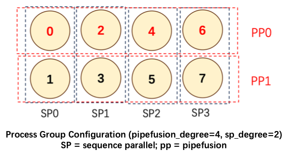
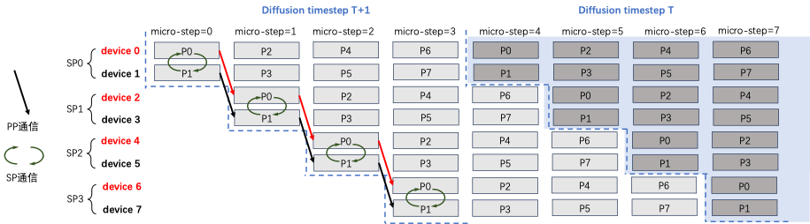
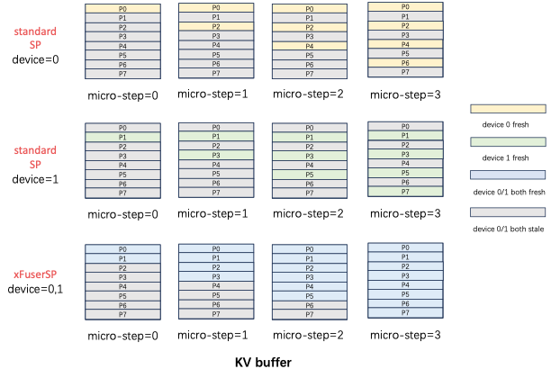

---
# 文章标题
title: Diffusion（文生图、文生视频）推理服务
# 设置写作时间
date: 2024-12-07
# 一个页面可以有多个分类
category:
  - SOSD
# 一个页面可以有多个标签
tag:
  - 分布式系统
  - 分布式推理
  - 文生图
# 此页面会在文章列表置顶
sticky: true
# 此页面会出现在文章收藏中
star: true
# 侧边栏的顺序
# 数字越小越靠前，支持非整数和负数，比如 -10 < -9.5 < 3.2, order 为 -10 的文章会最靠上。
# 个人偏好将非干货或随想短文的 order 设置在 -0.01 到 -0.99，将干货类长文的 order 设置在 -1 到负无穷。每次新增文章都会在上一篇的基础上递减 order 值。
order: -1.3
---

## 文生图

随着transformer在文本生成方面逐步展现出的巨大潜力和ChatGPT等生成式对话AI的逐步商业化, 处理多模态任务的价值也不断被挖掘, `文生图` `文生视频`等潜力巨大的任务类型开始提上研究日程.  

但是同生成式对话使用有限的文本量便能达成较为不错的生成效果不同, 文生视频和文生图任务由于图形任务的整体性对大块内存的使用提出了更为严苛的要求, 图块与图块 像素与像素之间的高度关联性也难以像文本推理一样通过简单的切分矩阵实现并发, 这使得最为常用的 `Diffusion`模型在生成时长和内存占用上的表现都差强人意.  

文生图 文生视频等多模态任务中的分布式推理服务就是在这种背景下被关注的.

目前考虑到的针对Diffusion的优化主要集中于以下几个方面:  

- 使用更好的solver, 减少采样步数, 避免多轮采样带来的内存开销
- 利用diffusion相邻step冗余考虑适当保存activate值, 避免不必要的重计算
- 使用diffusion parallelism
- 使用一些通用优化手段,像算子并行,图优化,模型压缩等等.

### DistriFusion

`https://openaccess.thecvf.com/content/CVPR2024/papers/Li_DistriFusion_Distributed_Parallel_Inference_for_High-Resolution_Diffusion_Models_CVPR_2024_paper.pdf`

`https://github.com/mit-han-lab/distrifuser`

> 2024的CVPR, 工作属于是Diffusion parallelsim的一种

#### 特点

- 无需训练
- 加速效果较好, 可以达到6倍以上加速
- 利用了diffusion过程相邻步之间feature map的相似性

#### 以往方法

`常规方法`: 多GPU通常仅用于批量推理. 在生成单张图像时，通常只涉及一个GPU.考虑到激活值规模庞大, 通信成本会超过分布式计算带来的节省, 张量并行等并行技术并不适合diffusion模型.

`传统分批方法`: 将图像split成N个patch，放在N个device上进行推理，然后将N个device的结果合成为一个全分辨率的结果.  
但是这种方法由于缺少各个patch间的信息感知，会生成N个小图拼接而成的大图, 边界处会出现明显的接缝, 区块间引入交互又会带来过高的同步成本  

> 用精度换效率, 但是图片不是整体了, 这也是前言讲难以像文本推理一样通过简单的切分矩阵实现并行的原因

#### 相关工作

difussion核心在迭代去噪点生成内容, 用巨量的计算换取极高的生成能力, 目前优化主要集中在以下几点:  

* 高效去噪: 如将高分辨率图像压缩为低分辨率的潜在表示，并在潜在空间中学习扩散模型
* 设计无需训练的高效采样算法: 基于扩散模型与微分方程之间的联系，并利用成熟的指数积分器来减少采样步骤
* 预训练的扩散模型中提炼出生成模型: 成效不佳
* 优化扩散模型的神经推理
* DistriFusion方法: 利用多个设备上的神经网络并行性来加速扩散过程

  

针对LLM的并行方法特点是: LLM模型尺寸较大, 但激活尺寸小, 不需要引入太多通讯开销.  

但difussion模型的特点是: 模型尺寸较小, 但激活尺寸大, 于是通信开销不得不成为主要矛盾, 目前主要只使用数据并行.  

本文方法基于patch并行性, 切分小patch分到不同设备处理, 倾向于使用AllGather而非AllReduce进行数据交互.  

#### 背景知识

扩散模型通常会训练一个噪声预测神经网络模型（如U-Net）$ϵ_{θ}$.  
从纯高斯噪声$x_{T} ∼ N(0, I)$开始，该模型需要经过数十到数百次的迭代去噪步骤，以获得最终的清晰图像$x_{0}$，其中T表示总步数.  
在时间步t给定含噪图像$x_{t}$，模型$ϵ_{θ}$会将$x_{t}$、t以及额外的条件c（例如文本）作为输入，以预测$x_{t}$中的相应噪声$ϵ_{t}$.  
在每个去噪步骤中，可以通过以下方程推导出$x_{t-1}$:  

$$ \mathbf{x}_{t-1}=\mathrm{Update}(\mathbf{x}_t,t,\epsilon_t),\quad\epsilon_t=\epsilon_\theta(\mathbf{x}_t,t,c). $$  

通过这个公式我们可以轻易发现${x}_{t-1}$和${x}_{t}$的强依赖关系, 这给$t$与$t-1$步的模型$ϵ$并行带来了极大的困难.  

同时本文还指出, 处理一张1024x1024的图像时，每步需要6,763 `GMACs（十亿次乘加运算）`。随着分辨率的增加，这种计算需求会以超过二次方的速度增加，导致生成单张高分辨率图像的延迟在实际应用中变得过高.  

> 作者还在这里cue了一下Shih等人在2023提出的ParaDiGMS, 说利用Picard迭代以数据并行的方式并行化去噪步骤, 是可能存在无效结果的&步数较大的去噪方式, 难以并行加速.
> 这篇文章也是NeurIPS 2023的一篇, 平均加速在2倍左右, 的确没有本文出色.

本文又一次强调了模型分片到多个设备上，并使用张量并行进行推理的大通讯量的不可行性.  

#### 本文方法  

* 将图像分割成多个区块，在多个设备间并行化处理计算, 这存在两个选择和两个问题:
  1. 独立计算各个区块并随后拼接 -> 边界处会出现明显的接缝和强烈的撕裂感
  2. 区块间同步传递中间激活信息 -> 极高的通信开销, 甚至超过计算时间

为解决上述问题, 本文提出了一种新的并行范式--`位移区块并行`.  

`核心`:利用前一步扩散过程中稍有过时或“陈旧”的激活信息，来促进区块间的交互.  

在计算某一区块某一层的激活信息时，并不依赖于其他区块的最新激活信息，从而使得通信可以被隐藏在后续层的计算过程中.  

> 两次扩散时间步的图相似度是很高的, 确实有相当一部分激活值完全可以"暂存"而不用"重计算"或者"通讯".

##### 位移补丁并行

在预测$ϵ_{θ}(x_{t})$（为简化说明，此处省略了时间步$t$和条件$c$的输入）时，首先将$x_{t}$分割成多个补丁$x_{t}^{(1)}$, $x_{t}^{(2)}$, ..., $x_{t}^{(N)}$，其中N表示设备的数量. 在例图使用了N=2.每个设备都拥有模型$ϵ_{θ}$的一个副本，并将独立且并行地处理一个单独的补丁.上标(1)和(2)分别代表第一个和第二个块，前一步的陈旧激活被加深了颜色.  

在每一步$t$，首先将输入$x_{t}$分割成N个块$x_{t}^{(1)}$, $x_{t}^{(2)}$, ..., $x_{t}^{(N)}$，对于每一层l和每个设备i，在获取输入激活块$A_{t}^{l,(i)}$之后，将执行两个异步操作：  

1. 在设备 i 上，$A_{t}^{l,(i)}$被重新分散回前一步的陈旧激活$A_{t}^{l}$.这个Scatter操作的输出随后被输入到稀疏操作$F_{l}$中（线性、卷积或注意力层），它仅在新鲜区域上执行计算并产生相应的输出.
2. 与此同时，对A_{t}^{l,(i)}执行AllGather操作，以准备下一步的完整激活$A_{t}^{l}$.  

最后，将最终输出聚合在一起，以近似$ϵ_{θ}(x_{t})$

#### 总结

DistriFusion是一种利用多GPU并行加速扩散模型的新方法.将图像分割成多个区块，并将每个区块分配给独立的GPU进行处理.同时复用前一步骤的预计算激活值，以保持区块间的相互作用.  

局限:  

1. 对于低分辨率图像，DistriFusion的加速效果有限.
2. 对于步数极少的方法，由于去噪状态迅速变化，该方法可能不适用.  

### PipeFusion

`https://arxiv.org/html/2405.14430v2`

> PipeFusion可以看作是在DistriFusion上的改进与推广, 重点是把DistriFusion方法移植到了DiT模型上, 证明了DistriFusion方法的泛用性.

#### 摘要

PipeFusion通过将图像分割成多个patch并跨多个GPU分布网络层，采用流水线并行方式来协调通信和计算.  

利用相邻扩散步骤输入之间的高相似性，通过复用一步旧的特征图来为当前步骤提供上下文，从而消除流水线中的等待时间  

#### 问题

* DiT模型的推理延迟显著，随着序列长度的增加，计算时间呈二次方增长.单GPU无法满足实际应用的延迟要求，需要跨多个计算设备并行化DiT推理.
* DistriFusion需要为每个GPU维护所有层的KV数据，导致GPU增加时内存开销增加.
* DistriFusion基于U-NET模型，在每个layer上做集合通信，通信开销较大.

#### 本文方法

> 和DistriFusion相同操作如patch分割, 异步修正, warmup预热不再赘述

PipeFusion与DistriFusion不同的是:

1. 采用流水线并行方式来协调不同设备上的计算和通信, 但保存原本激活值的方式和DistriFusion保持一致
2. 采用P2P通信, 考虑DiT模型特点, 不再像DistriFusion每个时间步的通信都是Scatter给每个设备, 而是点对点通信, 减少通信成本
3. 提升存储效率, 与DistriFusion相比，PipeFusion每个设备只存储与其特定阶段相关的参数的1/N.

### xDIT

DiT模型在文生图和文生视频等表现出了杰出的性能, 但是与此同时DiTs 的输入序列长度日益增长，序列增长导致Attention 机制的计算量也随之呈平方级膨胀, 推理延迟极为严重, 单卡推理必然无法满足需求, 多GPU乃至多机DiT部署是必然要求.

但是在之前都是基于hf diffusers库进行改造, 正如在vLLM前都是基于hf transformer进行改造, 都是临时的不成体系的方案, 迫切需求一个性能好且易用性高的DiT推理框架.  

于是, 在PipeFusion基础上升级的xDit诞生了.  

`https://arxiv.org/abs/2405.14430`  

`https://github.com/xdit-project/xDiT`  

DiT 和 LLM 推理任务特点不同, 改进思路也不同:  

1. LLM 有 Prefill 和 Decode 两阶段，分别是compute boundary和memory boundary的; 而DiT 的计算和 Prefill 相似是compute boundary的.  
2. LLM 模型很大，而序列长度有限(虽然现在长文本需求也在增加);而 DiT 正好反过来，模型不大，推理时序列长度很长, TP的适用性较低.  
3. LLM 模型大多收敛到微调 Llama 架构, 但DiT架构则呈现出较大差异性, 框架统一难度较大.

考虑到 DiT 的特点，本文提出一系列混合并行方式, 提供了一套优雅的开发接口，针对性解决了 DiT 模型更改难度高的问题，这套开发接口尽可能可能复用 diffusers 的现有逻辑，开发者通过一些 wrapper 实现复杂的混合并行，实现高效地扩展方法.

#### Overview

##### DiT 主干网络混合并行

xDiT支持四种基础并行策略`以任何形式混合`, `达到近似线性效果`:  

1. Pipefusion Parallel
2. Sequence Parallel
3. Data Parallel
4. CFG Parallel `https://arxiv.org/abs/2207.12598`

##### Parallel VAE

针对扩散模型后处理的解码 VAE 模块 (解码器模块)在高分辨率图像生成时 OOM (Out Of Memory)问题，xDiT 实现了 Patch Parallel 版本的 VAE.  

##### 简单灵活的开发接口

#### PipeFusion

见前文

#### USP：混合序列并行

见`MLSys_分布式开发（选读）` DeepSpeed-Ulysses部分  

#### CFG Parallel

Classifier-Free Guidance（CFG）是扩散模型领域的一个重要的技巧，可以提供更广泛的条件控制、减少训练负担、增强生成内容的质量和细节，以及提高模型的实用性和适应性.  

一个输入 prompt，使用 CFG 需要同时进行 unconditional guide 和 text guide 的生成, 就是DistriFusion 中的 split batch.  

#### Hybrid Parallel

xDiT 设计目标是扩展 DiT 推理过程到超大规模, 实现多机多卡, 不同并行方式混合在一起变得尤为重要.  

PipeFusion 和 Sequence 在图像内部的不同 Patch 间并行则较为复杂, 两种并行方式的混合使用，是 xDiT 核心创新点之一.  

PipeFusion利用过时的KV进行Attention计算，这使得PipeFusion无法像大型语言模型（LLM）那样轻松地实现并行策略的混合, 以pipe_degree=4，sp_degree=2的混合并行方法为例:  

标准 SP Attention实现，输入Q，K，V和输出O都是沿着序列维度切分，且切分方式一致。如果不同rank的输入patch没有重叠，每个micro step计算出fresh KV更新的位置在不同rank间也没有重叠.  

如下图所示，standard SP的KV Buffer中黄色部分是SP0 rank=0拥有的fresh KV，绿色部分是SP1 rank=1拥有的fresh KV，二者并不相同.  

在这个diffusion step内，device=0无法拿到P1,3,5,7的fresh KV进行计算，但是PipeFusion则需要在下一个diffusion step中，拥有上一个diffusion step全部的KV(保留旧有激活值避免大量通讯).  

standard SP只拥有1/sp_degree的fresh kv buffer，因此无法获得混合并行推理正确的结果.  

xDiT专门定制了序列并行的实现方式，以适应这种混合并行的需求.  

xDiT使用`xFuserLongContextAttention`把SP的中间结果存在KV Buffer内.  

效果如下图，每个micro-step SP执行完毕后，SP Group内不同rank设备的fresh KV是相互补充的.  

这样一个diffusion step后，SP Group所有设备的KV Buffer都更新成最新，供下一个Diffusion Step使用.  

#### Parallel VAE

VAE 模块在高清图片生成时, 会导致OOM(见`https://github.com/huggingface/diffusers/issues/5924`).  

在xDiT开发了 DistVAE解决了这个问题, 使用了两种关键策略:  

1. SP: 特征图分割成多个 Patch，并在不同设备上进行序列并行 VAE 解码, 中间激活所需的峰值内存减少到 1/N.  
2. 分块输入处理: 输入特征图分割成块，并依次送入卷积运算符